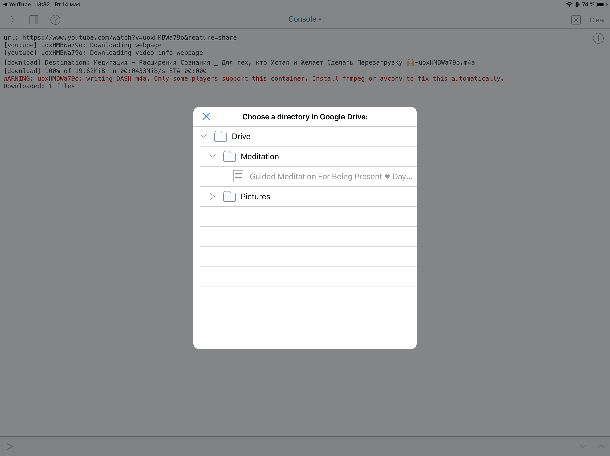
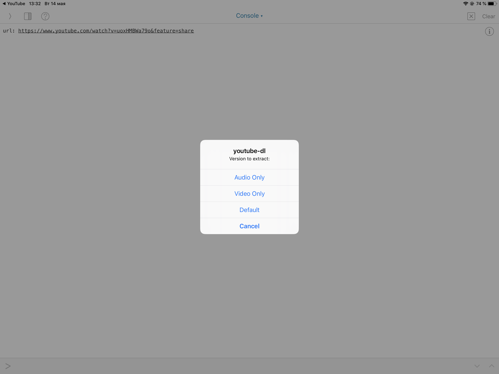

# iOS Youtube-DL to Google Drive
Adds a share extension to download youtube videos, soundcloud audio, etc and upload them to Google Drive

Requirements: Pythonista, Shortcuts, StaSh

HOW TO USE:

1. You must have Pythonista installed.  If you don't, get it in the App Store (it's free, and great)
2. Download this Github project.  Import youtube-dl.py, settings.yaml, driveFilePicker.py, and credentials.json to Pythonista

Pythonista automatically adds a share extension called Run Pythonista Script.  Tap that, then Import to Pythonista for each file.  Or use your own method.  NOTE: Most share extensions must be enabled when used the first time.  To do so, scroll right and tap More, then enable

3. Create a directory for the files (good organization). Call it yourube-dl
4. Now you need an Oauth Client ID for the script. Creating one is easy.  Go to Google API Console (in browser) and create a new project.  Then create an Oauth Client ID.  Google will want you to fill out the public user consent form.  Fill the necessary blanks with anything.  Don't request any special permissions. Tap the Download icon next to the client id.  Import as client_secrets.json to youtube-dl directory in Pythonista
5.  Add the Google Drive API to the Google project
6.  Open Youtube-DL.shortcut in Shortcuts and add it to the Shortcuts share extension (should be in Edit, Preferences)
7. If you don't have StaSh installed, get it from https://github.com/ywangd/stash.  Run `pip install youtube-dl` in StaSh.  This is the magic engine doing all the work.  Thank the devs.  Keep youtube-dl up to date.  

That's it! Now in the Youtube app (for example) tap Share --> Shortcuts --> Youtube-DL.  Pythonista opens and the console shows you progress.  When youtube-dl is finished downloading, a Directory Picker for your Google Drive shows up.  Choose where to save.  

Note 1: The first time you connect to your Drive, Oauth will need authentication.  After that it's smooth sailing.  Pythonista console will print a link, copy this link to your browser and log in with your Google account (whichever Drive you want to use)  
Note 2: If you name your folder in Pythonista something other than youtube-dl, you will need to change the URL path in the shortcut to correspond to the name

